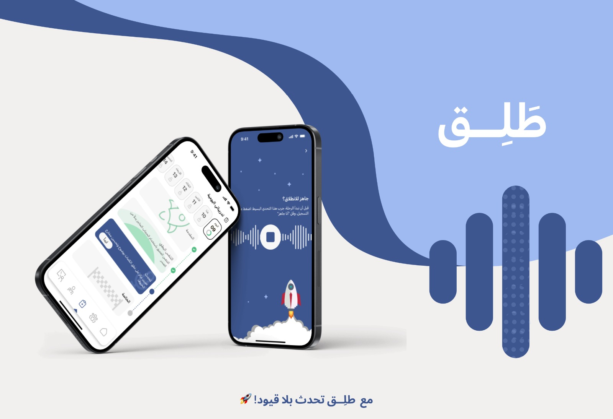
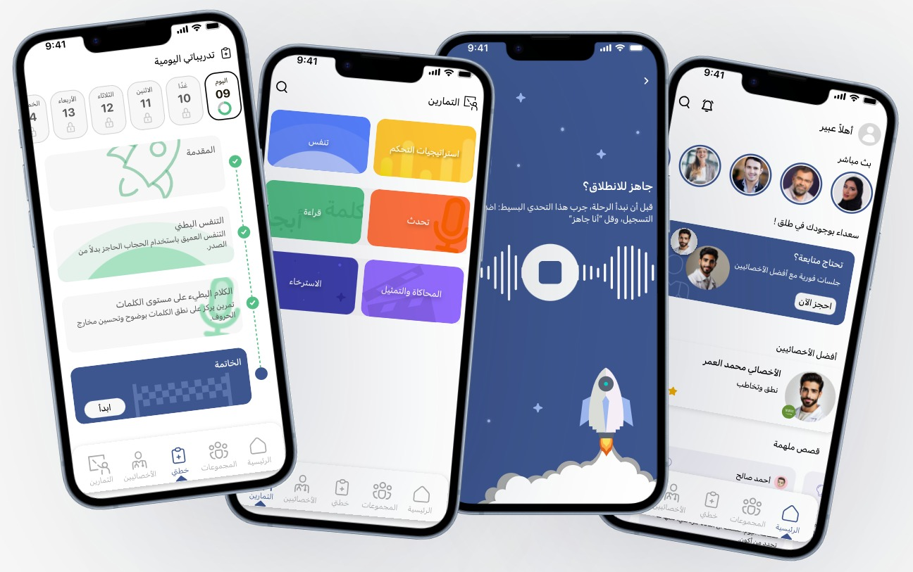

#  Taleq App

"Taleq" is an innovative application designed to help individuals who stutter practice effective daily exercises, aiding them in improving their fluency and regaining confidence in social communication. Through specialized techniques and interactive methods, users can train in a smooth manner and achieve tangible progress over time.

## ⚙️ Taleq Application Features
#  
- **Stuttering Level Assessment**: Users begin with an initial test to assess the severity of their stuttering.
- **Daily Treatment Plan**: A customized daily plan is generated to help users improve their speech fluency.
- **Supportive Community Access**: Join a community group to share experiences, challenges, and solutions with others facing similar situations.
- **Specialist Appointment Booking**: Schedule appointments with speech therapists to follow up on progress and receive expert guidance.
- **Interactive Exercises**: Perform daily interactive exercises based on proven therapeutic techniques.
- **Optional Notifications**: Get personalized notifications for daily exercises and upcoming specialist sessions.
- **Flexible Exercise Access**: Users can browse and choose speech exercises at any time and start practicing instantly, outside the daily treatment plan.

## 🏗️ Technologies Used

- 📱**Frontend**: Flutter, Dart.
- 🎨**Design**: Figma
- 📑**State Management**: Bloc (for robust and predictable state management).
- 💾**Supabase**: As the database system.
- 🎥**Lottie**: For animations.
- 🧼**Architecture**: Clean Architecture (for scalable, maintainable, and testable code).

---

## 💡Usage Instructions

1. Install all necessary packages with `flutter pub get`.
2. Set up the database in Supabase and integrate it with the app.
3. Run the application using `flutter run`.

---

## 🎨 Figma Design
Check out the complete design of the Taleq app on Figma:
[Taleq App Figma](https://www.figma.com/design/3YkN5WVeYaMgaz3aoIuWXd/Taleq-Flutter?node-id=721-6031&t=lf2rm8V7pwdSpwE1-1)

## 🚀 Team
- 👦🏻 Ahmed almansour - [Flutter Developer,Backend Developer]
- 👧🏻 Lojain Maged - [UI/UX Designer,Flutter Developer]
- 👩🏻 Wafaa Ali - [Flutter Developer,Backend Developer]